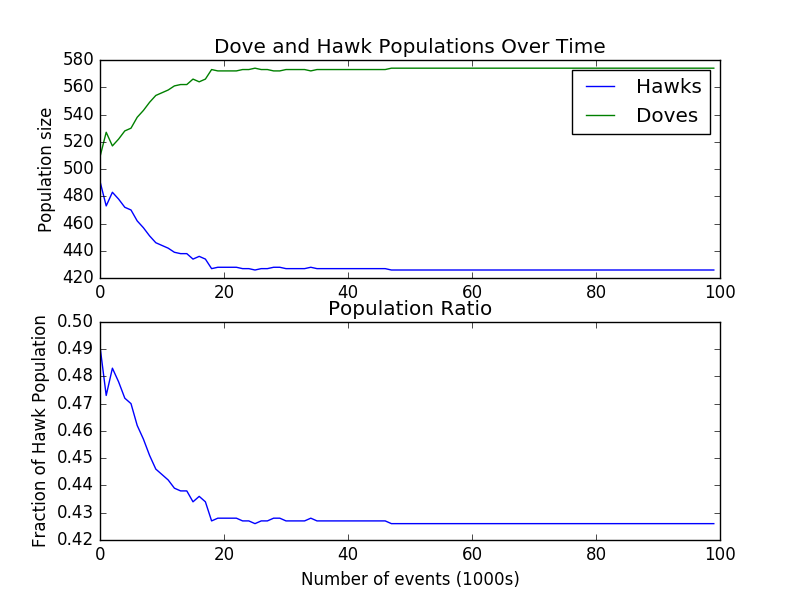

### ESS simulations from *The Selfish Gene* by Richard Dawkins.  

#### Doves and Hawks  

Dawkins discusses evolutionary strategies with stripped-down game theoretic examples in a few
different places within the book.  In chapter five, he discusses one of John Maynard Smith's 
hypothetical scenarios involving 'hawks' and 'doves', which describe respective fighting strategies
for two distinct groups within a population.  Hawks fight in an unrestrained manner until they are
seriously injured; doves simply posture, but never engage in fighting.  If a hawk and a dove meet,
the dove flees; if a hawk and a hawk meet, the fight until serious injury; and if a dove and a dove
meet, they posture until one tires or backs down.  

Dawkin's speculates with the following parameters:  

    > Now as a purely arbitrary convention we allot contestants 'points'.  Say 50 points for a win,
    0 for losing, -100 for being seriously injured, and -10 for wasting time over a long contest.  

For these parameters, the stable state is claimed to be 5/12 doves to 7/12 hawks.  How are these calculated? Simulating his scenario with a fixed population size (replacing a 'dead' bird with a 
new bird with a strategy randomly selected from the living population), I actually get the exact 
opposite (7/12 hawks to 5/12 doves).  

  

(Can generate the above by running the below)

    python doves_hawks.py --N 1000 
                          --events 100000 
                          --win 50 
                          --lose 0 
                          --health 0 
                          --tpenalty 10 
                          --injury 100  

Changing the `--tpenalty` parameter (cost of lengthy posturing for doves) to `22` gives us, approximately
the numbers claimed by Dawkins.. So not sure if his scenario has to do with specific fecundity rates or
ways of choosing reproductive birds??  Could this be a typo?  

Still, interesting point is that we do not actually care about the individual matchups - a hawk will 
always beat a dove - but rather the interplay between the two strategies, neither of which are 
stable individually yet are stable together.  

#### Mating strategy  

